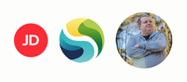
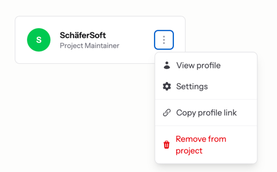
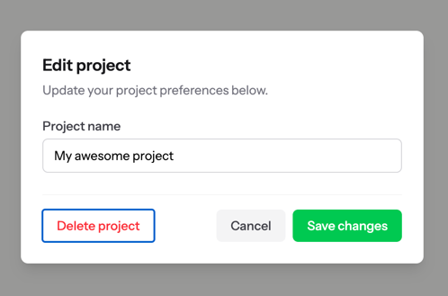
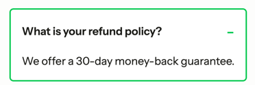
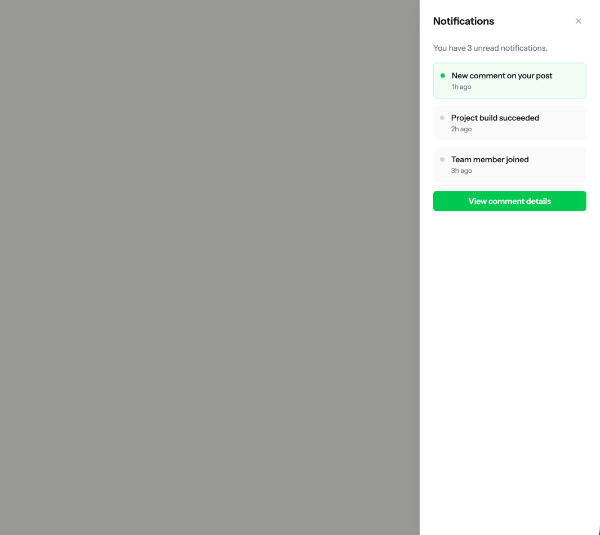
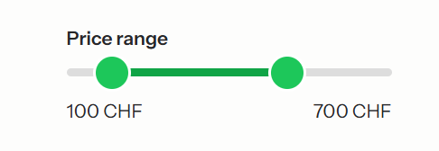
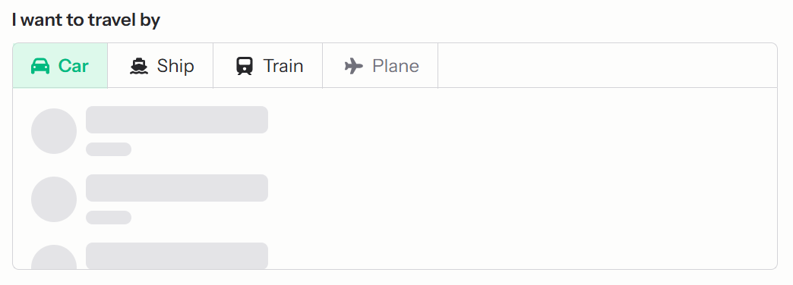
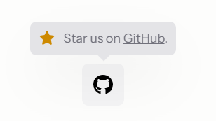

<div align="center">
    <a href="https://schaefersoft.ch">
        <picture>
            <source media="(prefers-color-scheme: light)" srcset="https://schaefersoft.ch/_static/logos/full_logo/dark/logo_full_dark.svg">
            
        </picture>
    </a>
</div>

# Laravel HeadlessUI

[](https://github.com/schaefersoft/laravel-headless-ui/actions)
[](https://packagist.org/packages/schaefersoft/laravel-headless-ui)
[](https://packagist.org/packages/schaefersoft/laravel-headless-ui)
[](LICENSE)

A collection of completely unstyled, accessible Laravel Blade UI components. Built with performance, customization and
accessibility in mind. **No additional JavaScript dependencies required.**

## Requirements

- PHP 8.2+
- Laravel 10, 11, 12, or 13

## Installation

```bash
composer require schaefersoft/laravel-headless-ui
```

The package auto-discovers its service provider. No manual registration needed.

## Setup

Import the required CSS and JS assets in your application.

### CSS

```css
@import '../../vendor/schaefersoft/laravel-headless-ui/resources/css/hui.css';

/* If you are using TailwindCSS, append layer(base) */
@import '../../vendor/schaefersoft/laravel-headless-ui/resources/css/hui.css' layer(base);
```

### JS

**Option 1: Pre-built (recommended)**

No TypeScript tooling needed. Works out of the box with any bundler or `<script type="module">`.

```javascript
import '../../vendor/schaefersoft/laravel-headless-ui/dist/js/hui.js'
```

**Option 2: TypeScript source**

Import the TS source directly if your project already has a TypeScript build pipeline (e.g. Vite with
`laravel-vite-plugin`).

```javascript
import '../../vendor/schaefersoft/laravel-headless-ui/resources/js/hui.ts'
```

## Components

All components use the `x-hui::` Blade prefix and are completely unstyled. Style them with your own CSS or utility
classes.

| Component                              | Preview                                                                                                 |
|----------------------------------------|---------------------------------------------------------------------------------------------------------|
| [Avatar](./docs/avatar.md)             |              |
| [Dropdown](./docs/dropdown.md)         |          |
| [Dialog](./docs/dialog.md)             |              |
| [Disclosure](./docs/disclosure.md)     |      |
| [Flyout](./docs/flyout.md)             |              |
| [Range slider](./docs/range-slider.md) |  |
| [Tabs](./docs/tabs.md)                 |                  |
| [Toggle](./docs/toggle.md)             |              |
| [Tooltip](./docs/tooltip.md)           |            |
