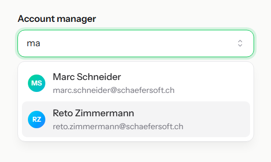
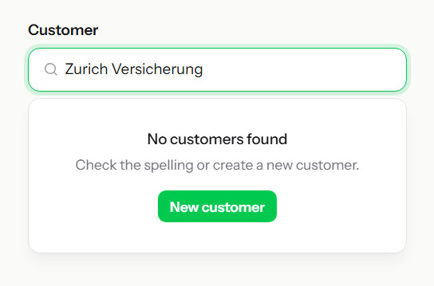
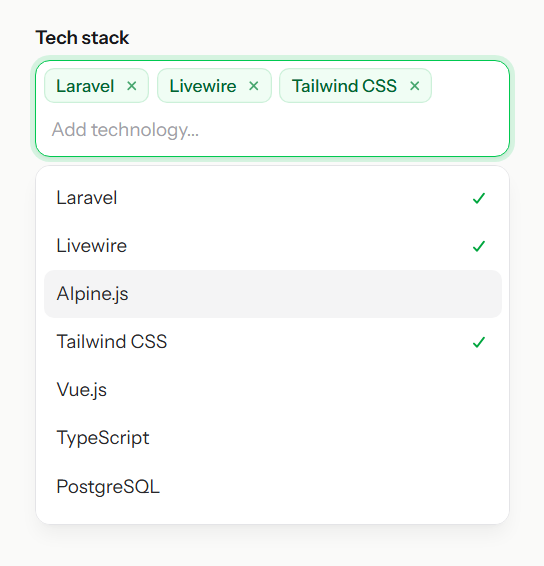
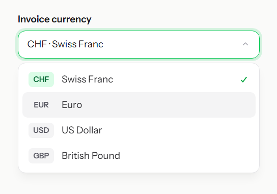
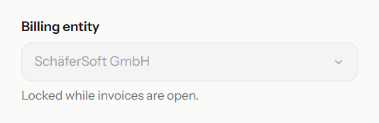

# Combobox

An accessible, searchable combobox with single and multiple selection, keyboard navigation, chips, form integration and
automatic, viewport-aware positioning. Not a native `<select>` — the options are fully customizable markup.



## Usage

Blade components: `x-hui::combobox`, `x-hui::combobox.input`, `x-hui::combobox.button`,
`x-hui::combobox.options`, `x-hui::combobox.option`, `x-hui::combobox.group`, `x-hui::combobox.no-results`,
`x-hui::combobox.chips`

### Single selection

```bladehtml
<x-hui::combobox id="account-manager" name="account_manager_id" :value="old('account_manager_id', $customer->account_manager_id)">
    <div data-hui-combobox-reference class="flex items-center rounded-xl border bg-white">
        <x-hui::combobox.input class="w-full px-3.5 py-2.5" placeholder="Search team members..." />
        <x-hui::combobox.button aria-label="Show team members">▾</x-hui::combobox.button>
    </div>

    <x-hui::combobox.options class="rounded-xl border bg-white p-1.5 shadow-lg">
        @foreach($teamMembers as $member)
            <x-hui::combobox.option :value="$member->id" :label="$member->name" class="flex gap-3 rounded-lg px-2.5 py-2 data-[active]:bg-zinc-100">
                avatar_url }}" alt="" class="size-7 rounded-full">
                <span>
                    {{ $member->name }}
                    <small class="block text-zinc-500">{{ $member->email }}</small>
                </span>
            </x-hui::combobox.option>
        @endforeach
        <x-hui::combobox.no-results>No team members found.</x-hui::combobox.no-results>
    </x-hui::combobox.options>
</x-hui::combobox>
```

Typing filters the options (case- and accent-insensitive). Selecting an option writes its label into the input and
closes the list. Closing without selecting restores the label of the current selection.

### No results

Content of `x-hui::combobox.no-results` is shown when no option matches the query. It can contain any markup, e.g. a
call to action.

```bladehtml
<x-hui::combobox.no-results class="px-4 py-6 text-center">
    <p class="font-medium">No customers found</p>
    <p class="text-sm text-zinc-500">Check the spelling or create a new customer.</p>
    <a href="{{ route('customers.create') }}">New customer</a>
</x-hui::combobox.no-results>
```



### Multiple selection

```bladehtml
<x-hui::combobox name="stack" multiple :value="['laravel', 'livewire', 'tailwind']">
    <div data-hui-combobox-reference class="flex flex-wrap gap-1.5 rounded-xl border bg-white p-1.5">
        <x-hui::combobox.chips class="contents" />
        <x-hui::combobox.input class="flex-1 min-w-28" placeholder="Add technology..." />
    </div>

    <x-hui::combobox.options>
        <x-hui::combobox.option value="laravel">Laravel</x-hui::combobox.option>
        <x-hui::combobox.option value="livewire">Livewire</x-hui::combobox.option>
        <x-hui::combobox.option value="alpine">Alpine.js</x-hui::combobox.option>
        <x-hui::combobox.option value="tailwind">Tailwind CSS</x-hui::combobox.option>
    </x-hui::combobox.options>
</x-hui::combobox>
```



In multiple mode clicking an option toggles it, the list stays open and the search query is cleared after each
selection. `Backspace` in an empty input removes the last selected value. Values are submitted as `stack[]`.

### Groups

```bladehtml
<x-hui::combobox.options>
    @foreach($teamMembers->groupBy('department') as $department => $members)
        <x-hui::combobox.group :label="$department" label-class="px-2.5 pt-2 text-xs font-semibold text-zinc-500">
            @foreach($members as $member)
                <x-hui::combobox.option :value="$member->id">{{ $member->name }}</x-hui::combobox.option>
            @endforeach
        </x-hui::combobox.group>
    @endforeach
</x-hui::combobox.options>
```

Groups are hidden while none of their options match the query. The heading is linked to the group via
`aria-labelledby`.

### Maximum selections

```bladehtml
<x-hui::combobox name="stack" multiple :max="3">...</x-hui::combobox>
```

Once the limit is reached, unselected options receive `aria-disabled="true"` and cannot be selected until a value is
removed. The combobox receives `data-max-reached` for styling. Only applies to multiple mode.

### Custom chips

`x-hui::combobox.chips` renders one chip per selected value. Pass markup as slot to use it as template — mark the
label element with `data-hui-combobox-chip-label` and the remove control with `data-hui-combobox-chip-remove`.

```bladehtml
<x-hui::combobox.chips class="flex gap-1">
    <span class="inline-flex items-center gap-1 rounded-lg bg-green-50 px-2.5 py-1 text-sm text-green-800">
        <span data-hui-combobox-chip-label></span>
        <button data-hui-combobox-chip-remove>✕</button>
    </span>
</x-hui::combobox.chips>
```

Without a slot a plain `<span>` with label and a `×` remove button is rendered. Remove buttons receive an
`aria-label` (`Remove <label>`) unless you provide one.

### Not searchable

```bladehtml
<x-hui::combobox name="currency" value="CHF" :searchable="false">
    ...
    <x-hui::combobox.options>
        <x-hui::combobox.option value="CHF" label="CHF · Swiss Franc">Swiss Franc</x-hui::combobox.option>
        <x-hui::combobox.option value="EUR" label="EUR · Euro">Euro</x-hui::combobox.option>
    </x-hui::combobox.options>
</x-hui::combobox>
```



The input becomes read-only and acts as the trigger: clicking toggles the list, `Space`/`Enter` open it and typing a
letter jumps to the first matching option (type-ahead).

### Disabled

```bladehtml
<x-hui::combobox disabled>...</x-hui::combobox>

<x-hui::combobox.option value="x" disabled>Unavailable</x-hui::combobox.option>
```



A disabled combobox disables the input, button, chip remove buttons and hidden form inputs. Toggling the
`data-hui-combobox-disabled` attribute at runtime is picked up automatically. Disabled options are skipped during
keyboard navigation and cannot be selected.

### Nullable

```bladehtml
<x-hui::combobox nullable>...</x-hui::combobox>
```

By default a single combobox keeps its selection when the input is cleared. With `nullable`, clearing the input and
closing the list removes the selection.

### Open on focus

Clicking into the input always opens the options. With `immediate` they also open when the input receives focus via
keyboard.

```bladehtml
<x-hui::combobox immediate>...</x-hui::combobox>
```

### Open by default

```bladehtml
<x-hui::combobox open>...</x-hui::combobox>
```

The options are shown on page load and close as usual (outside click, `Escape`, selection). Has no effect when the
combobox is disabled.

### Server-side search

Disable client-side filtering and replace the options when the `hui:combobox:search` event fires. Added or removed
options are detected automatically.

```bladehtml
<x-hui::combobox id="users" :filter="false">...</x-hui::combobox>
```

```javascript
document.getElementById('users').addEventListener('hui:combobox:search', async (e) => {
    const html = await fetch(`/users/search?q=${encodeURIComponent(e.detail.query)}`).then((r) => r.text())
    e.currentTarget.querySelector('[data-hui-combobox-options]').innerHTML = html
})
```

Labels of already selected values are cached, so chips and the input keep showing them when the options change.

### Option labels

The label shown in the input and chips defaults to the option's text content. Use `label` for options with rich
content:

```bladehtml
<x-hui::combobox.option :value="$user->id" :label="$user->name">
    avatar }}" alt=""> {{ $user->name }} <small>{{ $user->email }}</small>
</x-hui::combobox.option>
```

### JavaScript API

```javascript
import {
    openCombobox,
    closeCombobox,
    getComboboxValue,
    setComboboxValue,
    registerComboboxes,
} from '../../vendor/schaefersoft/laravel-headless-ui/dist/js/hui.js'

openCombobox('person')
closeCombobox('person')
getComboboxValue('person')          // '2' | null, or ['a', 'b'] in multiple mode
setComboboxValue('person', '3')
setComboboxValue('tags', ['php', 'vue'])
registerComboboxes(container)       // initialize comboboxes added after page load
```

Resetting the surrounding `<form>` restores the initial value.

## Positioning

The options list is positioned with `position: fixed`, so it escapes `overflow: hidden` containers and scrolling
parents (also inside transformed ancestors such as animated dialogs).

- Placed on the preferred side (`anchor`) and flipped to the opposite side when there is not enough room.
- When neither side fits, it uses the side with more room and limits `max-height` so the list scrolls.
- Horizontally clamped to the viewport with an `8px` margin; `max-width` never exceeds the viewport.
- Uses the visual viewport, so it stays visible above on-screen keyboards on mobile.
- Follows the reference element on scroll, resize and when the reference changes size (e.g. chips wrapping).
- `start`/`end` alignment respects `dir="rtl"`.

The list is anchored to the input by default. Add `data-hui-combobox-reference` to a wrapper element to anchor it to
that element instead (useful when input, button and chips share a styled container).

The options element receives `--hui-combobox-anchor-width` (width of the reference) and uses it as `min-width`.
Override the width with your own classes, e.g. `w-(--hui-combobox-anchor-width)` or `w-80`.

```bladehtml
<x-hui::combobox.options anchor="top end" :gap="8">...</x-hui::combobox.options>
```

`data-placement` (`top` or `bottom`) and `data-align` (`start`, `end` or `center`) reflect the resolved position.

## Transitions

```bladehtml
<x-hui::combobox.options
    data-hui-combobox-enter="transition duration-100 ease-out"
    data-hui-combobox-enter-from="opacity-0 scale-95"
    data-hui-combobox-enter-to="opacity-100 scale-100"
    data-hui-combobox-leave="transition duration-75 ease-in"
    data-hui-combobox-leave-from="opacity-100 scale-100"
    data-hui-combobox-leave-to="opacity-0 scale-95">
    ...
</x-hui::combobox.options>
```

## Styling

The combobox is completely unstyled. Use these attributes for state-based styling:

| Element  | Attribute        | When                                         |
|----------|------------------|----------------------------------------------|
| Combobox | `data-open`      | The options are visible.                     |
| Combobox | `data-disabled`  | The combobox is disabled.                    |
| Combobox | `data-has-value` | At least one value is selected.              |
| Combobox | `data-max-reached` | The `max` limit is reached.                |
| Options  | `data-placement` | Resolved side: `top` or `bottom`.            |
| Options  | `data-empty`     | No option matches the query.                 |
| Option   | `data-active`    | Highlighted via keyboard or pointer.         |
| Option   | `data-selected`  | The option is selected.                      |
| Option   | `data-disabled`  | The option is disabled.                      |

```bladehtml
<x-hui::combobox.options class="max-h-60 bg-white border rounded-md shadow-lg py-1">
    <x-hui::combobox.option value="1" class="px-3 py-2 data-[active]:bg-indigo-600 data-[active]:text-white data-[selected]:font-semibold">
        Wade Cooper
    </x-hui::combobox.option>
</x-hui::combobox.options>
```

## Events

| Event                  | When                       | Detail                                                                   |
|------------------------|----------------------------|--------------------------------------------------------------------------|
| `hui:combobox:open`    | Options opened             | —                                                                        |
| `hui:combobox:close`   | Options closed             | —                                                                        |
| `hui:combobox:change`  | Selection changed          | `{ value: string \| null \| string[], label: string \| null \| string[] }` |
| `hui:combobox:search`  | The search query changed   | `{ query: string }`                                                      |

## Props

### Combobox

| Prop         | Type                    | Default | Description                                                      |
|--------------|-------------------------|---------|------------------------------------------------------------------|
| `class`      | `string`                | `""`    | Custom classes for the container.                                |
| `name`       | `string\|null`          | `null`  | Renders hidden inputs for form submission (`name[]` if multiple). |
| `value`      | `string\|array\|null`   | `null`  | Initial selection. Arrays and collections are supported.         |
| `multiple`   | `boolean`               | `false` | Allows selecting multiple values.                                |
| `disabled`   | `boolean`               | `false` | Disables the whole combobox.                                     |
| `searchable` | `boolean`               | `true`  | Allows typing to search. `false` makes the input read-only.      |
| `nullable`   | `boolean`               | `false` | Clearing the input removes the selection (single mode).          |
| `immediate`  | `boolean`               | `false` | Also opens the options on keyboard focus (click always opens).   |
| `open`       | `boolean`               | `false` | Shows the options on page load.                                  |
| `max`        | `int\|null`             | `null`  | Maximum number of selected values (multiple only).               |
| `filter`     | `boolean`               | `true`  | Filters options client-side. Disable for server-side search.     |

> [!NOTE]
> Renders a `<div/>`. Use the `id` attribute for the JavaScript API.

### Input

| Prop    | Type     | Default | Description                     |
|---------|----------|---------|---------------------------------|
| `class` | `string` | `""`    | Custom classes for the input.   |

> [!NOTE]
> Renders an `<input type="text"/>` with `role="combobox"`. Other attributes such as `placeholder` are passed through.

### Button

| Prop    | Type     | Default | Description                      |
|---------|----------|---------|----------------------------------|
| `class` | `string` | `""`    | Custom classes for the button.   |

> [!NOTE]
> Renders a `<button type="button" tabindex="-1"/>` that toggles the options. Add an `aria-label` if it only contains
> an icon.

### Options

| Prop     | Type     | Default          | Description                                                             |
|----------|----------|------------------|-------------------------------------------------------------------------|
| `class`  | `string` | `""`             | Custom classes for the options container.                               |
| `anchor` | `string` | `"bottom start"` | `top` or `bottom`, optionally followed by `start` or `end`. Without alignment the list is centered. |
| `gap`    | `int`    | `4`              | Distance to the reference element in pixels.                            |

> [!NOTE]
> Renders a `<div role="listbox"/>`.

### Option

| Prop       | Type          | Default | Description                                              |
|------------|---------------|---------|----------------------------------------------------------|
| `value`    | `string\|int` | —       | Value of the option (required).                          |
| `label`    | `string\|null`| `null`  | Text shown in the input and chips. Defaults to the text content. |
| `disabled` | `boolean`     | `false` | Disables the option.                                     |
| `class`    | `string`      | `""`    | Custom classes for the option.                           |

> [!NOTE]
> Renders a `<div role="option"/>`.

### Group

| Prop         | Type          | Default | Description                        |
|--------------|---------------|---------|------------------------------------|
| `class`      | `string`      | `""`    | Custom classes for the group.      |
| `label`      | `string\|null`| `null`  | Heading of the group.              |
| `labelClass` | `string`      | `""`    | Custom classes for the heading.    |

> [!NOTE]
> Renders a `<div role="group"/>` with an optional heading `<div/>`.

### No results

| Prop    | Type     | Default | Description                     |
|---------|----------|---------|---------------------------------|
| `class` | `string` | `""`    | Custom classes for the element. |

> [!NOTE]
> Shown only when no option matches the query.

### Chips

| Prop    | Type     | Default | Description                           |
|---------|----------|---------|---------------------------------------|
| `class` | `string` | `""`    | Custom classes for the chip container.|

> [!NOTE]
> The slot is used as chip template. See [Custom chips](#custom-chips).

## Accessibility

### Keyboard

| Key                  | Action                                                        |
|----------------------|---------------------------------------------------------------|
| `ArrowDown`          | Open / move to next option                                    |
| `ArrowUp`            | Open (last option) / move to previous option                  |
| `Alt` + `ArrowDown`  | Open without highlighting an option                           |
| `Alt` + `ArrowUp`    | Close                                                         |
| `PageUp` / `PageDown`| Move to first / last option                                   |
| `Home` / `End`       | Move to first / last option (not searchable only)             |
| `Enter`              | Select highlighted option                                     |
| `Space`              | Open / select highlighted option (not searchable only)        |
| `Escape`             | Close (clears the query in multiple mode when already closed) |
| `Backspace`          | Remove last value when the input is empty (multiple)          |
| `Tab`                | Close                                                         |
| Type a letter        | Jump to first matching option (not searchable only)           |

### ARIA

- Follows the [WAI-ARIA combobox pattern](https://www.w3.org/WAI/ARIA/apg/patterns/combobox/).
- Input has `role="combobox"`, `aria-expanded`, `aria-controls`, `aria-autocomplete` and `aria-activedescendant`.
- Options container has `role="listbox"` and `aria-multiselectable` in multiple mode.
- Options have `role="option"`, `aria-selected` and `aria-disabled`.
- Focus stays in the input; the highlighted option is announced via `aria-activedescendant`.
