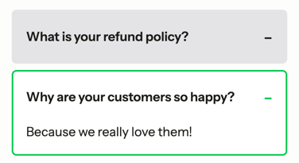

# Disclosure

Accessible disclosure built on native `<details>`/`<summary>` with optional accordion behavior.


## Usage

Blade components: `x-hui::disclosure`, `x-hui::disclosure.head`, `x-hui::disclosure.content`, `x-hui::disclosure.container`

```bladehtml
<x-hui::disclosure>
    <x-hui::disclosure.head>
        What is your refund policy?
    </x-hui::disclosure.head>

    <x-hui::disclosure.content>
        We offer a 30-day money-back guarantee.
    </x-hui::disclosure.content>
</x-hui::disclosure>
```

> [!NOTE]
> The head should be the first child inside the disclosure. The content can include any markup.

### Open by default

```bladehtml
<x-hui::disclosure opened>
    <x-hui::disclosure.head>
        Shipping details
    </x-hui::disclosure.head>
    <x-hui::disclosure.content>
        Ships within 2 business days.
    </x-hui::disclosure.content>
</x-hui::disclosure>
```

### Disabled

```bladehtml
<x-hui::disclosure disabled>
    <x-hui::disclosure.head>
        This is disabled
    </x-hui::disclosure.head>
    <x-hui::disclosure.content>
        You shouldn't be able to toggle this.
    </x-hui::disclosure.content>
</x-hui::disclosure>
```

### Accordion (limit open disclosures)

Use `x-hui::disclosure.container` with `max-count` to limit how many disclosures can be open at once. When a new one opens, the oldest open disclosure is closed.



```bladehtml
<x-hui::disclosure.container :max-count="1" class="space-y-2">
    <x-hui::disclosure>
        <x-hui::disclosure.head>General</x-hui::disclosure.head>
        <x-hui::disclosure.content>
            General content.
        </x-hui::disclosure.content>
    </x-hui::disclosure>

    <x-hui::disclosure>
        <x-hui::disclosure.head>Billing</x-hui::disclosure.head>
        <x-hui::disclosure.content>
            Billing content.
        </x-hui::disclosure.content>
    </x-hui::disclosure>
</x-hui::disclosure.container>
```

## Styling

Use the native `[open]` attribute and `data-disabled`/`data-opened` attributes. The summary has minimal defaults (pointer cursor and hidden default marker).

```bladehtml
<x-hui::disclosure class="group rounded-lg border border-zinc-200">
    <x-hui::disclosure.head class="flex items-center justify-between p-3">
        <span>Details</span>
        <span class="text-zinc-500 transition group-open:rotate-45">+</span>
    </x-hui::disclosure.head>
    <x-hui::disclosure.content class="p-3 pt-0 text-sm text-zinc-600">
        Disclosure content.
    </x-hui::disclosure.content>
</x-hui::disclosure>
```

## Props

### Disclosure

| Prop       | Type      | Default | Description                                            |
|------------|-----------|---------|--------------------------------------------------------|
| `class`    | `string`  | `""`    | Custom classes for the disclosure.                     |
| `opened`   | `boolean` | `false` | Starts opened (`open` attribute).                      |
| `disabled` | `boolean` | `false` | Disables toggling; renders `data-disabled="true"`.     |

> [!NOTE]
> Allows all valid HTML `<details/>` attributes (class, style, data-*, aria-*, etc.).

### Head

| Prop    | Type     | Default | Description                     |
|---------|----------|---------|---------------------------------|
| `class` | `string` | `""`    | Custom classes for the summary. |

> [!NOTE]
> Renders a `<summary/>` and allows all valid HTML `<summary/>` attributes.

### Content

| Prop    | Type     | Default | Description                     |
|---------|----------|---------|---------------------------------|
| `class` | `string` | `""`    | Custom classes for the content. |

> [!NOTE]
> Allows all valid HTML `<div/>` attributes (class, style, data-*, aria-*, etc.).

### Container

| Prop        | Type     | Default | Description                                                                |
|-------------|----------|---------|----------------------------------------------------------------------------|
| `class`     | `string` | `""`    | Custom classes for the container.                                          |
| `max-count` | `number` | `null`  | Maximum number of open disclosures at once. `1` behaves like an accordion. |

> [!NOTE]
> Allows all valid HTML `<div/>` attributes (class, style, data-*, aria-*, etc.).

## Accessibility

### Keyboard

| Key              | Action             |
|------------------|--------------------|
| `Enter` / `Space`| Toggle disclosure  |

### ARIA

- Built on native `<details>`/`<summary>` elements, which provide built-in disclosure semantics without additional ARIA roles.
- Disabled disclosures are marked with `data-disabled="true"`.
