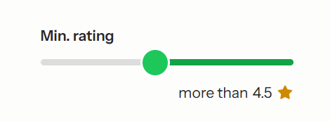
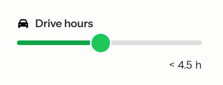

# Range Slider

The Range Slider provides a single- or dual-thumb slider with a filled track segment and optional synced inputs or
display elements.

## Usage

Blade component namespace: `x-hui::range-slider.*`.

### Basic two-thumb slider:


```bladehtml

<x-hui::range-slider>
    <x-hui::range-slider.track>
        <x-hui::range-slider.track.value/>

        <x-hui::range-slider.thumb role="min" name="lower" min="0" max="100" step="1" value="20"/>
        <x-hui::range-slider.thumb role="max" name="upper" min="0" max="100" step="1" value="80"/>
    </x-hui::range-slider.track>
</x-hui::range-slider>
```

> [!IMPORTANT]
> The thumbs of the range slider need a role to properly work. This can be `min`, `max`, or of the type
`Schaefersoft\HeadlessUI\Enums\RangeSlider\ThumbRole`.

> [!NOTE]
> All components **except** the `<x-hui::range-slider.thumb/>` are fully stylable though the `class` attribute

Since the `<x-hui::range-slider.thumb/>` renders a native `<input type="range"/>` under the hood, the thumbs must be
styled though css pseudo elements.

```css
.hui-range-slider .hui-range-slider-thumb::-webkit-slider-thumb,
.hui-range-slider .hui-range-slider-thumb::-moz-range-thumb {
    background: green;
}
```

Due to this implementation you can use all attributes, you would use on a `<input/>`, on the
`<x-hui::range-slider.thumb/>` aswell.

```bladehtml

<x-hui::range-slider.thumb disabled name="lower" min="0" max="100" step="1" value="20"/>
```

### Single-thumb variants:

- Only `min` thumb (fills from thumb to max edge):



```bladehtml

<x-hui::range-slider>
    <x-hui::range-slider.track>
        <x-hui::range-slider.track.value/>

        <x-hui::range-slider.thumb role="min" min="0" max="100" step="1" value="35"/>
    </x-hui::range-slider.track>
</x-hui::range-slider>
```

- Only `max` thumb (fills from min edge to thumb):



```bladehtml

<x-hui::range-slider>
    <x-hui::range-slider.track>
        <x-hui::range-slider.track.value/>

        <x-hui::range-slider.thumb role="max" min="0" max="100" step="1" value="65"/>
    </x-hui::range-slider.track>
</x-hui::range-slider>
```

## Synced Inputs and Displays

You can mirror values into inputs or any non-input element **inside the slider** using `x-hui::range-slider.input` or
bare
markup with the `data-hui-range-slider-value` attribute.

- Inputs (two-way): updating the slider updates the input; typing in the input updates the slider. Values snap to the
  slider's `step` and are clamped to avoid crossing.
- Displays (one-way): any non-input element with `data-hui-range-slider-value` has its text content kept in sync with
  the slider.

Examples:

```bladehtml

<x-hui::range-slider>
    <x-hui::range-slider.track>
        <x-hui::range-slider.track.value/>

        <x-hui::range-slider.thumb role="min" min="0" max="100" step="1" value="20"/>
        <x-hui::range-slider.thumb role="max" min="0" max="100" step="1" value="80"/>
    </x-hui::range-slider.track>

    <div>
        <x-hui::range-slider.input role="min" class="w-20"/> <!-- Two way binding for the lower value -->
        
        <span data-hui-range-slider-value="min"></span>  <!-- One way binding for the lower value -->
    </div>

    <div>
        <x-hui::range-slider.input role="max" class="w-20"/>  <!-- Two way binding for the upper value -->
        
        <span data-hui-range-slider-value="max"></span> <!-- One way binding for the upper value -->
    </div>
</x-hui::range-slider>
```

Notes:

- For single-thumb sliders, the missing side is treated as the edge (min or max) for fill and display.
- Clicking the track moves the closest thumb; if equidistant, the click side determines which thumb moves.
- Disabled thumbs cause the wrapper to reflect `aria-disabled="true"` when all thumbs are disabled.

## Props

### RangeSlider

> [!NOTE]
> Allows all valid HTML `<div/>` attributes (class, style, data-*, etc).

### RangeSliderTrack

> [!NOTE]
> Allows all valid HTML `<div/>` attributes (class, style, data-*, etc).
> 
### RangeSliderValue

> [!NOTE]
> Allows all valid HTML `<div/>` attributes (class, style, data-*, etc).

### RangeSliderThumb
> [!NOTE]
> Allows all valid HTML `<input/>` attributes (class, style, data-*, etc).

| Prop       | Type                    | Default                   | Description                                                                                                      |
|------------|-------------------------|---------------------------|------------------------------------------------------------------------------------------------------------------|
| `role`     | `string` or `ThumbRole` | (required)                | Determines if the thumb is the upper or lower value of the range slider.                                         |

### RangeSliderInput
> [!NOTE]
> Allows all valid HTML `<input/>` attributes (class, style, data-*, etc).

| Prop       | Type                    | Default                   | Description                                                                                                      |
|------------|-------------------------|---------------------------|------------------------------------------------------------------------------------------------------------------|
| `role`     | `string` or `ThumbRole` | (required)                | Determines if the thumb is the upper or lower value of the range slider.                                         |

