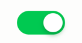
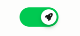

# Toggle

Accessible, headless toggle (switch) with keyboard support and form syncing.

Blade component namespace: `x-hui::toggle.*`.

## Usage



The toggle consists of two parts, the `<x-hui::toggle/>` and the `<x-hui::toggle.thumb/>`.

```bladehtml

<x-hui::toggle checked name="my_toggle">
    <x-hui::toggle.thumb/>
</x-hui::toggle>
```

### Disabled

The toggle can be disabled through the `disabled` attribute.

```bladehtml

<x-hui::toggle disabled name="my_toggle">
    <x-hui::toggle.thumb/>
</x-hui::toggle>
```

### Content inside the thumb

The thumb can contain child elements.



```bladehtml

<x-hui::toggle disabled name="my_toggle">
    <x-hui::toggle.thumb>
        <!-- Add any content - ex. SVG icon -->
    </x-hui::toggle.thumb>
</x-hui::toggle>
```

## Styling

Use the ARIA attributes to style the components. Use `aria-checked` and `aria-disabled`.

> [!NOTE]
> Minimal defaults are already provided. Some of these are required. All are overwritable.

````css
.hui-toggle {
    background-color: lightgray;
}
.hui-toggle[aria-checked="true"] {
    background-color: blue;
}

.hui-toggle .hui-toggle-thumb {
    background-color: white;
}
.hui-toggle[aria-checked="true"] .hui-toggle-thumb {
    filter: drop-shadow(/* add your drop shadow here */);
}
````

### Using tailwind
````bladehtml
<!-- Use a group to quickly and simply style the thumb -->

<x-hui::toggle class="group bg-zinc-200 aria-checked:bg-green-500">
    <x-hui::toggle.thumb class="group-aria-checked:drop-shadow-green-700 group-aria-checked:drop-shadow-lg/60"/>
</x-hui::toggle>
````

## Props

### Toggle

| Prop       | Type      | Default | Description                                                                             |
|------------|-----------|---------|-----------------------------------------------------------------------------------------|
| `class`    | `string`  | `""`    | Custom classes for the toggle.                                                          |
| `checked`  | `boolean` | `false` | Initial checked state; reflected to `aria-checked`.                                     |
| `disabled` | `boolean` | `false` | Disables interaction; reflected to `aria-disabled` and removes focus (`tabindex="-1"`). |
| `name`     | `string`  | `null`  | When set, renders a hidden checkbox and keeps it in sync.                               |

> [!NOTE]
> Allows all valid HTML `<div/>` attributes (class, style, data-*, aria-*, etc.).

### Thumb

| Prop    | Type     | Default | Description                   |
|---------|----------|---------|-------------------------------|
| `class` | `string` | `""`    | Custom classes for the thumb. |

> [!NOTE]
> Renders a `<div/>` marked with `aria-hidden="true"`. It mirrors `aria-checked`/`aria-disabled` for styling.

## Keyboard control

The component can be toggle with the spacebar, when focused.

