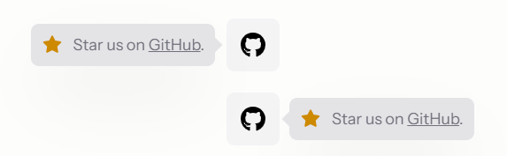
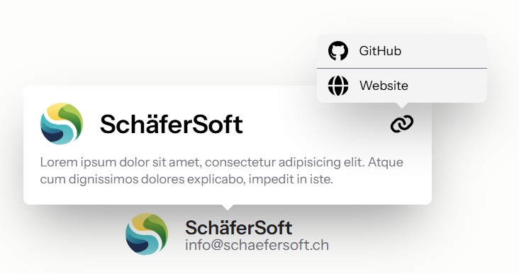

# Tooltip

A minimal, responsive tooltip that supports hover, focus, and touch. Auto-positions to stay within the viewport and closes on outside click or `Escape`.

## Usage

Blade components: `x-hui::tooltip`, `x-hui::tooltip.content`

```bladehtml
<x-hui::tooltip>
    Hover or tap me

    <x-hui::tooltip.content>
        Tooltip content goes here.
    </x-hui::tooltip.content>
</x-hui::tooltip>
```

> [!NOTE]
> - Works with mouse (hover), keyboard (focus), and touch (tap to show, tap outside to close).
> - Positions itself above by default, flips to another side if needed, and clamps within the viewport.

### With arrow


```bladehtml
<x-hui::tooltip>
    Hover me

    <x-hui::tooltip.content arrow>
        Tooltip with arrow
    </x-hui::tooltip.content>
</x-hui::tooltip>
```

### Position preference



```bladehtml
<x-hui::tooltip>
    Left Pref
    <x-hui::tooltip.content arrow position="left">
        I prefer left, will flip if needed.
    </x-hui::tooltip.content>
</x-hui::tooltip>

<x-hui::tooltip>
    Bottom Pref
    <x-hui::tooltip.content arrow position="bottom">
        I prefer bottom, will flip if needed.
    </x-hui::tooltip.content>
</x-hui::tooltip>
```

### Open by default

```bladehtml
<x-hui::tooltip open>
    Hover me
    <x-hui::tooltip.content arrow>Opened by default</x-hui::tooltip.content>
</x-hui::tooltip>
```

### Disabled

```bladehtml
<x-hui::tooltip disabled>
    Hover me
    <x-hui::tooltip.content>Will not open (disabled)</x-hui::tooltip.content>
</x-hui::tooltip>
```

When combined with `open`, the tooltip stays visible and cannot be closed until the attributes change.

### Nested tooltips



```bladehtml
<x-hui::tooltip open>
    Hover me
    <x-hui::tooltip.content>
        <x-hui::tooltip>
            Hover me nested
            <x-hui::tooltip.content>
                Nested content
            </x-hui::tooltip.content>
        </x-hui::tooltip>
    </x-hui::tooltip.content>
</x-hui::tooltip>
```

## Styling

The content panel uses `position: fixed` and `z-index: 9999`. Override with your own classes.

```bladehtml
<x-hui::tooltip>
    Trigger
    <x-hui::tooltip.content class="rounded-lg bg-zinc-900 px-3 py-1.5 text-sm text-white shadow-lg">
        Styled tooltip
    </x-hui::tooltip.content>
</x-hui::tooltip>
```

## Props

### Tooltip

| Prop       | Type      | Default | Description                                                                                                          |
|------------|-----------|---------|----------------------------------------------------------------------------------------------------------------------|
| `class`    | `string`  | `""`    | Custom classes for the wrapper.                                                                                      |
| `open`     | `boolean` | `false` | Opens the tooltip by default. When used with `disabled`, the tooltip stays open and cannot be closed.                |
| `disabled` | `boolean` | `false` | Disables interactions. If combined with `open`, the tooltip remains visible until one of the attributes changes.     |

### TooltipContent

| Prop       | Type                                   | Default | Description                                                                                          |
|------------|----------------------------------------|---------|------------------------------------------------------------------------------------------------------|
| `class`    | `string`                               | `""`    | Custom classes for the content panel.                                                                |
| `arrow`    | `boolean`                              | `true`  | Shows a small arrow pointing toward the trigger; color matches the content background.               |
| `position` | `"top"` / `"bottom"` / `"left"` / `"right"` | `"top"` | Preferred placement. Auto-flips to avoid viewport overflow.                                          |

## Accessibility

### Keyboard

| Key      | Action                           |
|----------|----------------------------------|
| `Escape` | Close an open tooltip            |

### ARIA

- The tooltip content has `role="tooltip"`.
- `aria-hidden` is toggled (`true`/`false`) based on visibility.
- The tooltip opens on focus and closes on blur, making it keyboard-accessible without additional interaction.
